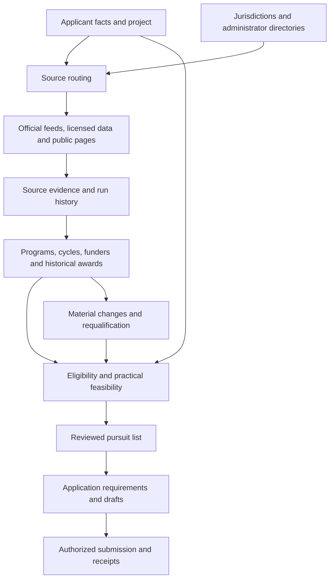

# Nationwide grant discovery and application design

Planning baseline: October 1, 2026. The intended scope is US applicants across all 50 states, the District of Columbia, inhabited territories and tribal jurisdictions. Nationwide scope is a design commitment and research plan, not a claim of complete opportunity coverage.

October 2 implementation update: v0.2.0 adds explicit public document collection,
optional PDF text extraction, local keyword search, current-export comparison,
and evaluation of reviewer-supplied evidence and mandatory predicates. The table
and milestones below preserve the original planning baseline; current executable
behavior and limits are in [RUNTIME.md](RUNTIME.md) and [QUALIFICATION.md](QUALIFICATION.md).

The product should help a business, nonprofit, researcher, college, school, government, tribe, farmer, artist or individual find relevant funding, understand the actual conditions, decide whether pursuing it is practical, and prepare a supported application. Applicant categories need their own tested rules. A source route supporting a category does not establish a working eligibility engine for that category.

Source order follows the applicant, project and geography. There is no universal federal-first sequence. This design supersedes earlier business-only, federal-first and California/Pennsylvania-first planning assumptions. Existing convenient APIs are useful adapter fixtures; they do not determine which applicants or places deserve coverage.

## What exists and what remains proposed

The source of truth for executable commands is [the CLI](../grant_engine/__main__.py), with routes in [the source registry](../grant_engine/data/us-sources.json) and command details in [RUNTIME.md](RUNTIME.md). The runtime supports reviewed-rule checks, not autonomous rule extraction or submissions.

| Capability | Implementation boundary |
|---|---|
| Source registry and planning | `sources` and `plan` accept a JSON registry and filter/rank discovery routes using jurisdiction, applicant hints and purpose tags. Non-implemented adapters become explicit agent research tasks. Route scores are not eligibility scores or award probabilities. |
| Structured discovery | `discover grants-gov` implements bounded no-key retrieval. `discover common-grants` supports an allowlisted set of AgileSix state-feed hosts for CA, PA, WA and MD. Those are third-party normalized feeds, not official state endpoints. A bounded run does not establish complete national or statewide collection. |
| Public evidence storage | `ingest` writes normalized public records and material revisions into SQLite, with source/program/cycle identity, hashes and retrieval evidence. Run metadata retains completeness and errors. |
| Review and portability | `report`, `export`, `check` and `replay` support human-readable evidence, JSON history export, integrity checking and restoration into an empty store. This is not a client case-management system. |
| Agent workflow | Markdown guidance supports research, qualification review, drafting and authorized submission procedures. Guidance is not proof that a deterministic runtime performs those steps. |
| Applicant matching and feasibility | Proposed. No implemented general eligibility rules engine, verified all-applicant match service or financial-feasibility calculator. |
| Monitoring | Proposed. Evidence revisions are a foundation for detecting change, but the runtime does not provide an installed scheduler, complete amendment graph or notification service. |
| Application workbench | Proposed. No runtime application tracker, portal automation, compliance validator or automatic submission engine. |

The public store must contain public source evidence only. Do not import private applicant profiles, credentials or confidential applications into it. Its structured-field checks are defense in depth, not reliable detection of secrets hidden in arbitrary text. Any future applicant store requires an explicit privacy, access-control and retention design.

## How professional grant research informs the product

Professionals combine several research methods. They search current notices, study funders' past recipients and priorities, follow geographic administrators, track programme calendars, use professional networks and read the actual application instructions. They do not assume that every funder accepts unsolicited proposals. Candid's [prospecting guidance](https://candid.org/blogs/funder-prospecting-strategy-securing-nonprofit-grants-101/) and [application-instruction guidance](https://learning.candid.org/find-funder-application-instructions/269056) support that distinction.

The product should preserve the different outputs of this work:

| Research question | Evidence route | Correct output |
|---|---|---|
| Can this applicant apply now? | Current notice, amendments, funder page and application instructions | A specific cycle with cited eligibility and deadlines |
| Which funders are promising? | Historical awards, peer recipients, present mission and approach policy | Funder prospects, including invited-only prospects |
| Who administers money locally? | Federal/state programme to jurisdiction, board, foundation or other intermediary | Actual downstream application route and service area |
| Can customers use funding to buy our services? | Employer/beneficiary programme and provider rules | Separate applicant, beneficiary and vendor analysis |
| Is an application worth the work? | Eligible costs, award terms, cash timing, match, capacity and evaluation criteria | Pursuit decision with practical constraints |
| Can the application be delivered correctly? | Current requirements and documented applicant capabilities | Reviewed narrative, budget, attachments and submission plan |

Human expertise matters where a notice uses judgment, relationships or discretionary selection. Agent assistance can reduce research and drafting effort; it must not invent partnerships, credentials, financials, outcomes or eligibility.

## Applicant-led source routing

| Applicant or project | Useful starting routes | Critical distinctions |
|---|---|---|
| Ordinary business | Local/state economic development, workforce boards, utilities, rural/export administrators, corporate competitions | Grant versus reimbursement, loan, tax credit, equity or service |
| Nonprofit/community organization | Community foundations, current private calls, city/county regranting, relevant public agencies | Open versus invited; fiscal sponsorship; service population and geography |
| Research company/researcher/university | Agency solicitations, research discovery products, state innovation funds and institutional research offices | Institution versus individual applicant; topic fit; internal nomination and sponsor deadlines |
| Government/school/public entity | State agencies, regional administrators, formula/discretionary programmes and federal notices | Designated recipient versus competitive applicant; match and authority to apply |
| Tribe/Native organization | Tribal and federal authorities, Native funders and jurisdiction-specific sources | Recognition, membership, Native-led status and beneficiary population are separate |
| Farmer/rural enterprise | Regional agriculture calls, extension and Rural Development | Producer grant versus intermediary technical assistance or finance |
| Artist/individual/household/student | Arts agencies, councils, foundations and programme-specific assistance | Grant, scholarship, prize and beneficiary assistance must be labeled separately |
| Training or service provider | Customer subsidy administrators and provider onboarding requirements | Vendor revenue is not the vendor receiving a grant |

No requirement should be universal merely because it is common in one lane. SAM registration, SBA size standards, 501(c)(3) status, accredited institutional affiliation and tribal recognition apply only when the controlling notice requires them. Sensitive applicant attributes must be supplied or confirmed, never inferred from names or appearance.

## Architecture: directory graph plus evidence

The public-evidence CLI implements part of the collection/storage path. The applicant, assessment, monitoring and application paths are proposed. A portable CLI, SQLite relationships, JSON interchange and Markdown review artifacts are sufficient for the next stage; a graph server, hosted application or vector database is not required to represent the model.

Directory records connect a jurisdiction to its departments, community foundations, workforce boards, utilities, extension offices, arts councils and tribal authorities. Programmes connect originating funders to administrators and downstream cycles. One administrator can cover several jurisdictions; several administrators can serve the same county. Service boundaries must not be reduced to a ZIP or a state label.

A national directory establishes where to look. It does not establish an available grant. For example, the [Council on Foundations locator](https://cof.org/page/community-foundation-locator) routes to foundations, [CareerOneStop](https://cloudfront.careeronestop.org/LocalHelp/WorkforceDevelopment/find-workforce-development-boards-help.aspx) routes to workforce boards, and the [BIA directory](https://www.bia.gov/service/tribal-leaders-directory) provides tribal identity/routing data. Current administrator notices control the actual opportunity.

### Required records

Keep these identities separate, extending the current public schema as implementation proceeds:

- **Source:** publisher, official/third-party role, source class, jurisdiction, access mode, adapter, rights, supported applicant hints, last verification and known gaps.
- **Programme and administrator:** enduring programme identity, originating funder, intermediary relationships and geography.
- **Opportunity cycle:** round/year, status, source IDs, application access, instrument, deadlines/stages, eligibility documents and amendments.
- **Funder prospect:** mission, historical fit and approach policy; may have no public cycle.
- **Historical award:** recipient, award/reporting dates, amount semantics and programme links. Never silently promoted to an open opportunity.
- **Evidence assertion:** exact document/record, publication/modification/retrieval times, content hash and clause locator, with extraction separate from interpretation.
- **Run:** request/query, connector/schema version, pages/records expected and received, rejected records, completeness, errors, cost and last-good state.
- **Assessment and application:** proposed private records tied to applicant and opportunity revisions, reviewed rules, decisions, requirements and receipts.

Use typed financial fields for total programme pool, per-award bounds, eligible cost base, match, reimbursement fraction, fees, currency and payment schedule. A programme's total budget is not the applicant's likely award.

CommonGrants is a promising [exchange protocol](https://github.com/HHS/simpler-grants-gov/blob/8584b47a4ed4e88a27db4fc10a48629527b69665/api/src/api/common_grants/COMMON_GRANTS_INTEGRATION.md), not a complete internal evidence model. Preserve native source payloads and companion evidence for information that a normalized exchange omits. Standards compatibility does not prove a feed is authoritative, complete or licensed for every use.

Reuse public feed contracts before copying a provider's runtime. The [Agile Six service core](https://github.com/agilesix/cg-mcp-grant-seeker/blob/ac7cded9332a18387b274fb49880ff8ddf01c8c6/docs/shared-grant-service.md) is a possible future TypeScript integration; the current Python product consumes its four public state feeds directly. That avoids four duplicate ETL deployments and a UI/MCP stack. Retain official notice fallbacks and provider-specific freshness limits. Research reviewed 27 relevant GitHub candidates at varying depth; no project established a turnkey national engine.

### Authority, identity and source health

Deduplicate exact authoritative IDs and cycles first, then reviewed aliases. A federal parent programme, local subgrant and prior-year cycle are related records, not duplicates. Official and third-party copies should retain their distinct provenance.

A valid amendment supersedes only the terms it changes. New retrieval time does not make a generic landing page more authoritative than a formal notice. Store `amends`, `supersedes`, `withdraws`, `reopens` and `mirrors` relationships. Preserve registration, LOI, concept-paper, institutional and full-application deadlines with timezones.

Failed retrieval means stale or inaccessible evidence. It does not mean closed funding. An empty page, missing attachment, changing pagination total or ignored critical filter must be visible. Proposed full-corpus synchronization must stage and reconcile a complete snapshot before promotion, preserving the last good data when the refresh is incomplete. The current bounded adapters must not be advertised as implementing that full synchronization system.

## Qualification and financial viability

The proposed matching system needs four independent judgments: opportunity state, eligibility, practical feasibility and pursuit decision. Eligibility results are pass, fail, unresolved or not applicable, each supported by a clause and applicant fact. A reviewable pass is our assessment, not funder approval. Missing mandatory documents, unresolved exceptions or unknown applicant facts prevent a confirmed-eligible claim.

Rank after mandatory gates. Use explainable fit and effort dimensions, not an opaque score presented as a probability of award. Query expansion can broaden research using programme vocabulary; it cannot change the applicant's actual project to fit a notice.

Practical feasibility includes:

- Cash paid before reimbursement, eligible-cost caps and disallowed costs.
- Required cash or in-kind match and evidence that it can be met.
- Timing of application, award, project start, reimbursement and delivery.
- Staff capacity, procurement, reporting and post-award obligations.
- Restrictions involving geography, relocation, ownership, intellectual property or equity.
- Preparation effort compared with realistic usable funding, without an invented win rate.

A hypothetical $10,000 project reimbursed at 80% may require the applicant to fund $10,000 upfront and ultimately carry at least $2,000. Actual allowable costs, caps and timing must come from the notice. [USDA RBDG](https://www.rd.usda.gov/programs-services/business-programs/rural-business-development-grants) illustrates another trap: a programme can benefit businesses while excluding them as direct grantees.

## Proposed monitoring and application workbench

Monitor material changes to deadlines, eligibility, funding availability, forms and cancellations. Requalify affected assessments against their exact evidence revisions. Compare document hashes as well as catalogue text. Polling cadence is a configurable operational target, not a source freshness guarantee; always refresh the controlling notice before an important application action.

An application workbench should produce a requirement matrix: question or criterion, supporting applicant evidence, draft location, word/page/file constraints, budget relationship and reviewer status. Drafting should reuse confirmed facts and preserve unanswered questions. Portal filling and submission require channel-specific authority and an exact reviewed payload.

Track prepared, authorized, transmitted, received, validated, agency-retrieved, reviewed, awarded, agreement-executed and paid states separately. [Grants.gov's status guidance](https://www.grants.gov/help/applicants/check-application-status) distinguishes receipt, validation and agency retrieval. Check for an existing receipt before retrying a submission. No submission automation or notification schedule is installed by this document.

## Prioritized milestones and proof

| Priority | Deliverable | Release gate |
|---|---|---|
| 1: make evidence dependable | Harden current CLI/registry, public-data boundary, bounded pagination, identity, replay and truthful reports | Deterministic offline fixtures plus bounded live checks; explicit partial/error state; export/replay preserves history; no private data in fixtures |
| 2: broaden source methods nationwide | Representative official feeds, public tables, PDFs, dynamic portals and administrator directories across regions and applicant types | Publish a source-by-source capability matrix; measure unique useful discoveries; resolve parser failures without claiming comprehensive states |
| 3: reviewed qualification | Applicant-specific rules, unknown handling, evidence-linked decisions and cash/effort analysis | Independent reviewers reconstruct every critical verdict; no critical false-eligible result in the release benchmark; unseen cases included |
| 4: source change operations | Full snapshots where available, amendments, material diffs and targeted requalification | A deadline-only PDF change is detected; outage is not closure; partial refresh does not replace complete evidence |
| 5: application workbench | Requirement matrix, document/budget checks, versioned draft package and submission-state model | Frozen-notice compliance checks; negative cases for missing attachments and invalid budgets; duplicate-send/receipt tests before any channel integration |
| 6: licensed expansion | Vendor samples and precisely licensed integrations | Incremental qualifying opportunities or maintenance savings justify cost; caching, display, AI use, exports and termination terms explicitly cover the intended product |

These milestones are capability gates, not a rule to postpone nonprofits, tribes, governments or territories until after businesses. Each early benchmark includes those categories for discovery and truthful unsupported/unresolved results. A category earns automated qualification support only through its own positive and negative tests.

### Benchmark design

Use synthetic applicant profiles and frozen, dated primary notices. Cover several regions, rural/urban areas, territories and tribal contexts. Include active, forecast, closed, invited-only, historical and inaccessible sources; grants, reimbursements, loans, prizes, contracts and assistance; and direct applicant, intermediary, beneficiary and vendor roles.

Measure discovery recall against an independently assembled reference set, precision of usable results, eligibility errors, deadline/status errors, evidence completeness, change latency and reviewer effort. Do not imply national recall from a small reference corpus. Separate transport/schema tests from extraction, matching and application tests. Passing one layer is not proof of the next.

Include regression cases for duplicate federal mirrors, annual cycles, state portal migrations, timezone cutoffs, unknown budget, fiscal sponsorship, reimbursement cash needs, invitation-only funders and ambiguous service territory. Hold out notices and applicant profiles that were not used to build rules.

## Product economics and optional providers

Measure cost per reviewed actionable opportunity, including subscriptions, collection, OCR, model work, maintenance and human verification. Report fixed subscriptions separately from marginal calls. Evaluate vendors on incremental current matches after deduplication, evidence quality, update latency and review time saved, not database row counts or historical dollars awarded.

Firecrawl can be evaluated as an optional retrieval/change-detection provider using the same source benchmark. [Change tracking](https://docs.firecrawl.dev/features/change-tracking) is a documented feature, not proof of grant-specific coverage. Alexandria is optional and **not selected**; its [provider model](https://www.firecrawl.dev/blog/alexandria-chatgpt-codex) must demonstrate relevant source access, rights and economics before adoption. Neither is a prerequisite for the public-source CLI or agent-assisted research.

For source evidence, primary links, licensing limits and specific next tests, read [SOURCE-RESEARCH.md](SOURCE-RESEARCH.md). No product claim should promise universal coverage, guaranteed eligibility, application acceptance or award success.
